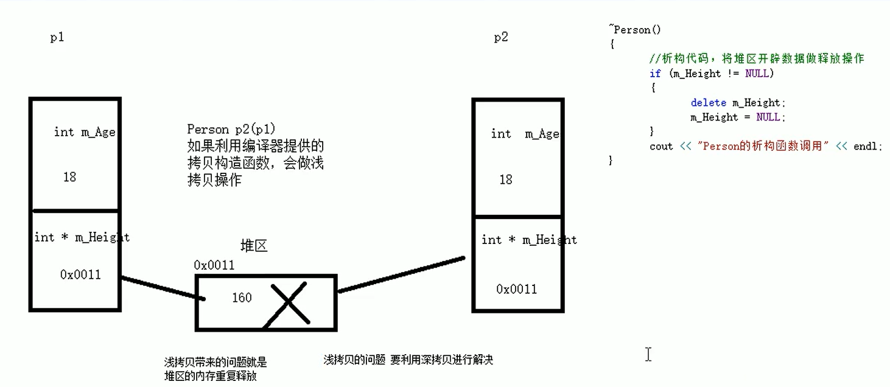
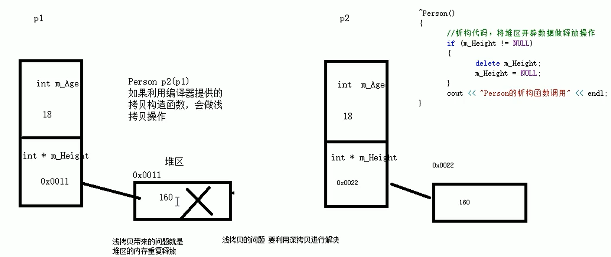

# 对象的初始化和清理
C++的面向对象来自生活，生活中我们使用的电子设备在使用前都会先进行出厂设置<b>（对象初始化）</b>，在某一天不使用时会删除数据<b>（对象清理）</b>，在C++中，利用构造函数进行对象初始化，利用析构函数清理对象。

## 构造函数和析构函数
问题五：构造函数和析构函数是什么？有什么作用？ 
答：在C++中，利用构造函数进行对象初始化，利用析构函数清理对象。<b>如果不提供构造函数和析构函数，编译器会会提供空实现的构造函数和析构函数。</b>
- 构造函数：主要用于创建对象时为对象的成员进行赋值，构造函数由编译器自动调用，无需手动调用；
- 析构函数：主要用于对象销毁前由系统自动调用，执行一些清理工作。
  
问题六：构造函数和析构函数的语法？ 
答： 
<b>构造函数语法：`类名(){}`</b> 
1、没有返回值； 
2、函数名和类名相同； 
3、构造函数可以有参数，允许重载； 
4、程序在调用对象时由编译器自动调用，且只调用一次。 
<b>构造函数语法：`~类名(){}`</b> 
1、没有返回值； 
2、函数名和类名相同，在函数名前加个`~`； 
3、构造函数不可以有参数，无法重载； 
4、程序在调用对象时由编译器自动调用，且只调用一次。 

## 构造函数的分类和调用
问题七：构造函数按参数和类型怎么分类？ 
答：按参数分，分为<b>无参构造函数</b>和<b>有参构造函数</b>；按类型分，分为<b>普通构造函数</b>和<b>拷贝构造函数</b>。 
问题八：如何通过实例化对象调用（无参，有参，拷贝）构造函数？ 
答： 
1、括号法： 
- 无参构造函数（默认构造函数）：`Person p;`
- 有参构造函数：`Person p(参数);`
- 拷贝构造函数：`Person p(其他对象);`
- [注]调用默认构造函数时，不用加()，因为编译器会把`Person p();`理解为函数的声明。

2、显示法： 
- 无参构造函数（默认构造函数）：`Person p;`
- 有参构造函数：`Person p = Person(参数);`
- 拷贝构造函数：`Person p = Person(其他对象);`
- [注]显示法是通过匿名对象来进行赋值。

3、隐式转换法： 
- 无参构造函数（默认构造函数）：`Person p;`
- 有参构造函数：`Person p = 参数;`
- 拷贝构造函数：`Person p = 其他对象;`
- [注]隐式转换法是通过转换为显示法来进行理解的。

问题九：什么是匿名对象，有什么特点？ 
答：没有定义名称的对象称为匿名对象，匿名对象的特点是当前行执行结束后，系统会立即回收匿名对象资源。注意不要用拷贝构造函数初始化匿名对象，因为`Person(p)`会被理解成`Person p`，在`p`对象已经定义的情况下会发生重定义错误。

## 拷贝构造函数的调用时机
问题十：拷贝构造函数系统调用的时机有哪三种？ 
答：
- 使用一个已经创建完毕的对象来初始化一个新的对象；
- 以值传递的方式给函数形参传值；
- 以值方式返回局部对象。

## 构造函数的调用规则
问题十一：构造函数的调用规则有哪些？ 
答：1、创建一个类时，编译器会给每个类添加3个函数。 
- 默认构造（空实现）
- 析构函数（空实现）
- 拷贝构造（值拷贝）
 
2、用户自定义构造函数优先级
- 如果用户定义有参构造函数，编译器将不提供默认构造函数，但是会提供默认拷贝构造函数；
- 如果用户定义拷贝构造函数，编译器将不提供其他的构造函数。

## 深拷贝和浅拷贝
问题十二：什么是深拷贝和浅拷贝？ 
答：浅拷贝是指编译器提供的等号赋值操作，深拷贝指在堆区中重新申请空间进行拷贝操作。
  
问题十三：浅拷贝会带来什么问题？怎么解决？ 
答：如下图，浅拷贝会带来堆区内容重复释放的问题，可以通过深拷贝解决。 
  
如果属性有在堆区开辟内存的操作，一定要自己提供拷贝构造函数，否则会带来堆区内容重复释放的问题。

## 语法：初始化列表
问题十四：初始化列表可取代传统的形参初始化，语法是什么？ 
答：语法：`构造函数():属性1(值1)，属性2(值2)...{}`。

## 类对象作为另一个类的成员
C++中A类的对象作为B类的成员，该成员称为对象成员。 
问题十五：在A类中通过什么方法初始化B类，A与B的构造和析构调用的先后顺序是怎样的？ 
答：A类中可通过构造函数的隐式转换法构造B类即`类B 对象b=构造参数`，当其他类对象作为本类成员时，构造时先构造类对象，再构造自身。析构时候先析构自身，再析构成员对象。

## 4.2.8 静态成员
问题十六：静态成员是啥？有什么特点？ 
答： 
在定义成员时前面加上`static`关键字，特点是：
- 所有的对象共享同一份数据；
- 在编译阶段已经分配好内存；
- 类内声明，类外初始化。

 
问题十七：静态成员的访问方式？ 
答:

- 通过对象访问；
- 通过类作用域访问；
- 静态成员也是有访问权限的。