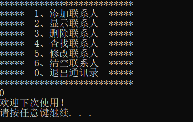
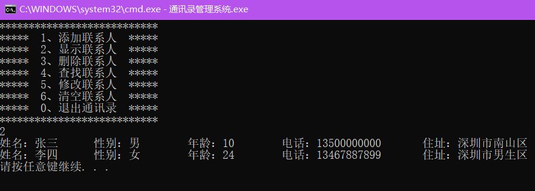

# 1、通讯录管理系统
利用C++实现一个通讯录管理系统。 
需要实现的功能如下：
- 添加联系人：向通讯录中添加新人，信息包括（姓名，性别，年龄，联系方式，家庭住址），最多记录1000人；
- 显示联系人：显示通讯录中所有联系人的信息；
- 删除联系人：按照名字进行删除指定联系人；
- 查找联系人：按照姓名查看指定联系人信息；
- 修改联系人：按照姓名重新修改指定联系人；
- 清空联系人：清空通讯录中所有信息；
- 退出通讯录：退出当前使用的通讯录。
  
# 2、创建项目
- 新建`Source Files`文件夹存放源文件和`Header Files`文件夹存放头文件；
- 在`Source Files`中新建`通讯录管理系统.cpp`。
 至此，项目创建完毕。

# 3、菜单功能
<b>功能描述：</b>用户选择功能的界面
   
用户界面效果如下：

<b>步骤：</b>
- 封装函数显示界面，如`void showMenu()`；
- 在`main`中调用封装好的函数。

# 4、退出功能
<b>功能描述：</b>退出通讯录系统
   
<b>思路：</b>根据用户不同的选择进入不同的功能，可以用`switch`分支实现，将整个架构进行搭建。
  
当用户选择0时退出，选择其他时不做操作，也不会退出程序。

  
效果图如下：

# 5、添加联系人
<b>功能描述：</b> 
实现添加联系人功能，联系人上限为1000人，联系人信息包括（姓名，性别，年龄，联系方式，家庭住址）
   
添加联系人实现步骤： 

- 设计联系人结构体
- 设计通讯录结构体
- main函数中创建通讯录
- 封装添加联系人函数
- 测试添加联系人功能

# 6、显示联系人
<b>功能描述：</b> 
显示通讯录中已有的联系人信息
   
显示联系人实现步骤：

- 封装显示联系人函数；
- 测试显示联系人功能。
界面需求图如下：

# 7、删除联系人
<b>功能描述：</b> 
按照姓名删除指定的联系人
   
删除联系人实现步骤：

- 封装检测联系人是否存在的函数；
- 封装删除联系人的函数；
- 测试删除联系人的功能。

## 7.1、检测联系人是否存在
设计思路：检测联系人是否存在，存在则返回联系人所在数组的位置，不存在返回-1。

## 7.2、封装删除联系人的函数
设计思路：使用数组往前移动实现联系人的删除。

# 8、查找联系人
<b>功能描述：</b> 
按照姓名查看指定的联系人信息
   
查找联系人的实现步骤：

- 封装查找联系人的函数；
- 测试查找指定联系人。

## 8.1、封装查找联系人的函数
设计思路：判断用户指定联系人是否存在，如果存在显示信息，不存在则提示查无此人。

# 9、修改联系人
<b>功能描述：</b> 
按照姓名修改指定的联系人信息
   
修改联系人的实现步骤：

- 封装修改联系人的函数；
- 测试修改指定联系人。

## 9.1、封装查找联系人的函数
设计思路：查找用户指定联系人，如果查找成功进行修改，查找失败则提示查无此人。

# 9、清空联系人
<b>功能描述：</b> 
清空通讯录中的所有信息
   
清空联系人的实现步骤：

- 封装清空联系人的函数；
- 测试清空联系人。

## 10.1、封装清空联系人的函数
设计思路：将通讯录所有人的信息清除掉，只要将通讯录中的联系人数量置0，做逻辑清空即可。