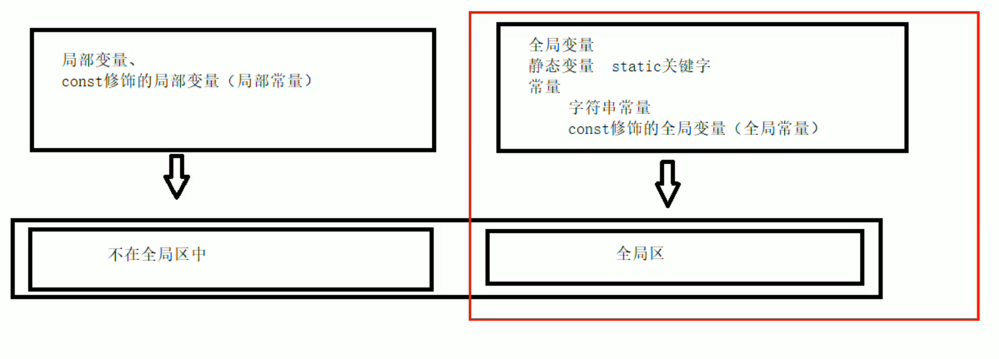
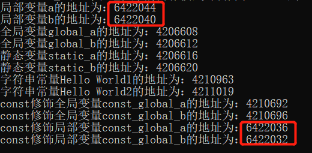
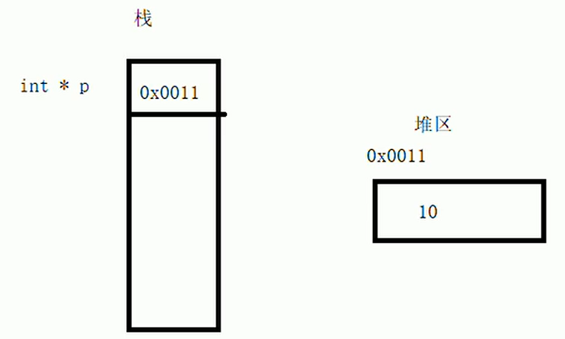

# 内存分区模型

C++程序执行时，将内存大方向分为四个<b>区域</b>。
- 代码区：存放函数体的二进制代码，由操作系统进行管理；（存放所有代码）
- 全局区：存放全局变量，静态变量以及常量；
- 栈区：由编译器自动分配和释放，存放函数的参数值，局部变量等；（编译器掌管生死）
- 堆区：由程序员分配和释放，若程序员不释放，程序结束时由操作系统回收。（程序员掌管生死）

内存四区的意义：
不同区域存放的数据，赋予不同的生命周期，给编程赋予了更多灵活性。

## 1.1、程序编译后运行前产生的两个区域
在程序编译后运行前，生成了exe的可执行程序，<b>未执行程序前</b>分为两个区域： 
<b>代码区：</b> 
​&emsp;&emsp;存放CPU可执行的二进制机器码指令； 
​&emsp;&emsp;代码区是<b>共享</b>的，共享的目的是，对于频繁被执行的程序，在内存中只要有一份代码即可； 
​&emsp;&emsp;代码区是<b>只读</b>的，只读的目的是，防止程序意外地修改指令。 

<b>全局区：</b> 
​&emsp;&emsp;全局变量和静态变量存于此； 
​&emsp;&emsp;还包含常量区，字符串常量和`const`关键字修饰的全局变量（全局常量）；     
<table><tr><td bgcolor=purple>该区域的数据在程序结束后，系统自动回收。</td></tr></table>
[注]：const修饰的局部变量（局部常量）不在全局区。 
如下图所示： 

01全局区的实验结果也可以看出： 

## 1.2、程序运行后产生的两个区域
<b>栈区：</b> 
​&emsp;&emsp;存放函数的参数（形参）和局部变量（由编译器自动分配释放）。 
[注]：不要返回局部变量的地址。

<b>堆区：</b> 
​&emsp;&emsp;用new开辟的内存（由程序员分配释放，如果程序员不释放，程序结束由操作系统回收）。 

问题一：如何返回局部变量地址对局部变量进行操作？ 
答：在函数中利用new关键字在堆区中开辟数据空间，再将地址返回。由于堆区中的数据是由程序员分配和释放的，所以程序运行时系统不会回收。工作机制如下图所示： 

## 1.3、new操作符和delete操作符
堆区中的数据是由程序员使用new操作符开辟，delete操作符释放。 
问题二：如何使用new操作符在堆区中给数据和数组分配空间？怎么释放？ 
对于基本类型的数据，使用`new 数据类型 (data)`开辟数据空间时，会返回该数据对应类型的指针。释放时使用`delete 数据地址`； 
对于数组，使用`new 数据类型 [length]`开辟数组空间时，会返回该数据对应类型的指针。释放时使用`delete []数组首地址`。
