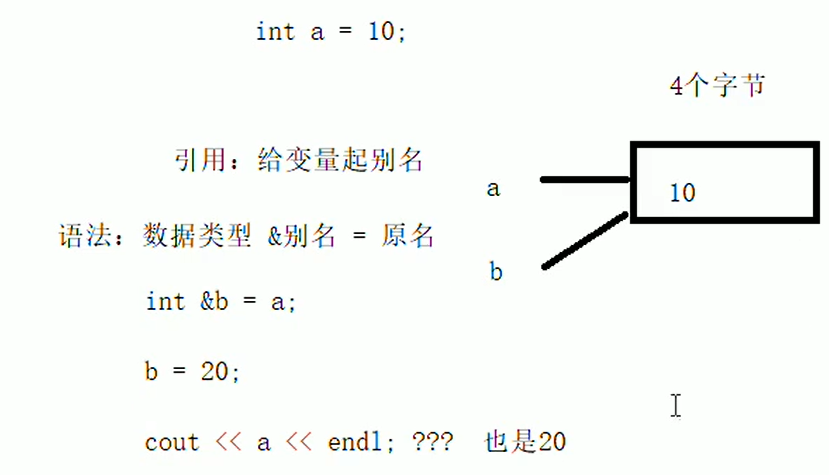
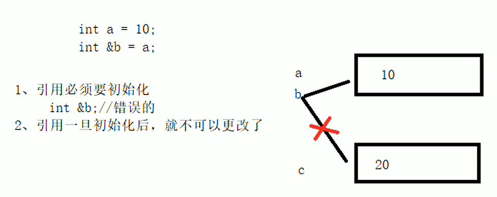
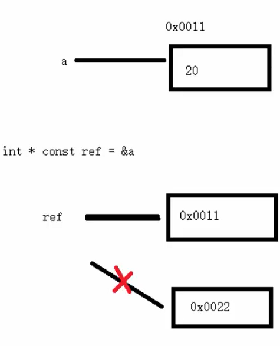

# 引用
## 2.1 引用的基本使用
问题一：引用的语法和作用是什么？ 
答：引用的本质是给变量起别名，语法是`数据类型 &别名=原名`。改变别名的值同时也会修改原名的值。  
引用的本质原理图: 

## 2.2 引用的注意事项
- 引用必须初始化；
- 引用初始化后，值不可以改变。
如下图所示： 

## 2.3 引用做函数参数
问题二：引用做函数参数的作用和优点？ 
答：函数传参时，可以利用引用技术让形参修饰实参；优点是可以不使用指针进行地址传递。  
问题三：引用传递为什么能让形参修饰实参？ 
答：引用传递是给变量起了别名，对别名进行的任何操作相当于对原名进行操作。  
## 2.4 引用做函数返回值
问题四：为什么不要返回局部变量的引用？ 
答：因为局部变量存放在内存四区的栈区中，第一次返回正确因为编译器做了保留，第二次该变量的内存已经释放掉。  
问题五：什么是函数的左值？ 
答：函数做左值时，必须使用引用。函数的返回值是引用时，函数调用时可采用`function()=XXX`对返回值进行修改，对左值的修改相当于对函数内部的变量进行修改，也相当于对变量的别名进行修改。  

## 2.5 引用的本质
问题六：引用的本质是什么？ 
答：引用的本质就是一个指针常量。比如`int &ref = a;`编译器会自动转为`int * const ref = &a;`由于指针常量的指针指向不可改，所以引用一旦初始化，就不可修改。`ref = 20;`，内部发现ref是引用之后，会自动解引用转换为`*ref = 20;`。
具体流程如下所示。  

## 2.6 常量引用
问题六：什么是常量引用？ 
答：常量引用可以前面加上`const`对常量引一块合法的内存空间，使用场景是用`const`修饰函数形参，可以防止形参改变实参，从而防止误操作。  