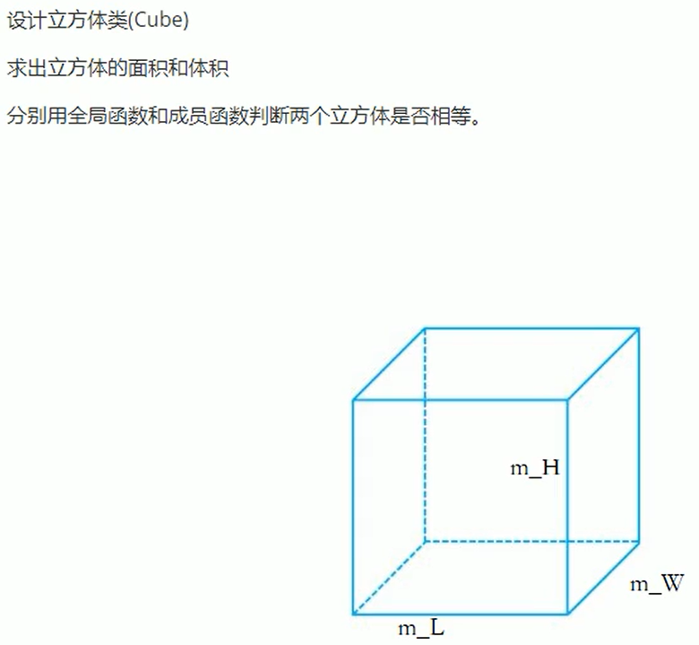
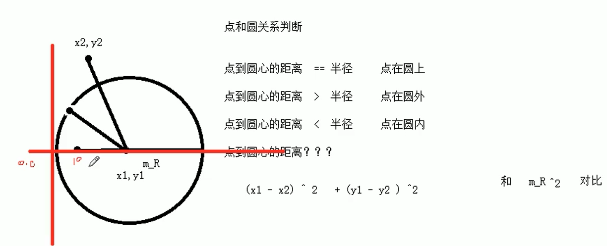

# 类和对象
问题一：C++面向对象的特性是什么？ 
答：三大特性为封装，继承和多态。C++认为万物都是对象，对象上有其属性和行为。例如人可以作为对象，属性有姓名，年龄，身高...，行为有吃饭，睡觉...，在C++中，可以通过类来实例化对象（通过类来创建对象）。类中的属性和行为统一称为成员，其中属性称为成员属性或成员变量，行为称为成员函数或成员方法。 

# 封装的意义
问题二：C++封装的意义是什么？ 
答：
- 将属性和行为作为一个整体来表现生活的事物，属性用变量表示，行为用函数表示；
- 将属性和行为的权限加以控制。 
语法是`class 类名{访问权限：属性 / 行为}`。

问题三：C++类中的访问权限有哪些？ 
答：类中的访问权限有三种。分别是`public`，`protect`和`private`。
- public权限：成员在类内可以访问，在类外也可以访问；
- protect权限：成员在类内可以访问，子类可以访问父类的保护内容，除了子类外不可以访问；
- private权限：成员在类内可以访问，类外都不可以访问。

## class和struct的区别
问题四：C++中的`class`和`struct`的区别？ 
答：C++中`class`很像用户自定义的数据类型`struct`，它们都可以表现一个类。它们之间的区别在于：<b>两者默认的访问权限不同</b>。
- `struct`默认权限是公有的；
- `class`默认的权限是私有的。

## 成员属性私有化
问题四：成员属性私有化的优点？ 
答：
- 可以自己控制读写权限；
- 对于写权限，我们可以检测数据的有效性。

## 案例一：设计立方体类
需求如下：  

  
实现结果如下：  

## 案例二：点和圆的关系
需求如下：  
设计一个圆类（Circle）和一个点类（Point），计算点和圆的关系。判断点在圆内，圆上还是在圆外。

  
实现结果如下：  

  
问题四：如何把一个类拆成头文件和源文件中？ 
答：在一个类中，可以让另一个类作为本类的成员。一个类拆分为头文件和源文件的步骤：
- 在头文件中写类的定义以及成员变量和成员函数的声明。为防止头文件重复包含子头文件，在声明头文件时需要加上`#pargma once`；
- 在源文件定义成员函数时需要加上成员函数的类作用域`类名::成员函数`，否则源文件中定义的函数被当成全局函数。

