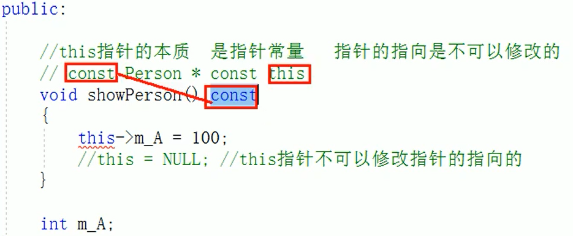

# 4.3 C++的对象模型和this指针
## 4.3.1 成员变量和成员函数分开存储
C++中的类内的成员变量和成员函数是分开存储的，只有非静态的成员变量才属于类对象。<br>
问题1：空对象占内存多大字节？类中分别定义一个非静态变量或一个静态变量或一个静态函数或一个非静态函数分别占多少字节？<br>
答：空对象占一个字节的内存大小，类中只有非静态的成员变量是属于类对象的，所有除了非静态成员变量，其他不占对象的字节大小。


## 4.3.2 this 指针概念
每一个静态成员函数只有一个实例，这一块的代码是所有对象共享的，怎么区分哪个对象调用该成员函数呢？<br>
问题1：this指针是什么？它的用途是什么？<br>
答：this指针是C++提供的对象指针，this是用来指向被调用的函数的所属对象。this指针不需要定义。<br>
用途：
- 解决形参和成员变量的命名冲突问题；
- 可以通过`return *this`返回对象本身。

## 4.3.3 空指针访问成员函数
问题2：空指针可以访问成员函数吗？<br>
答：空指针可以访问成员函数，如果成员函数有<font color='red'>用到成员变量</font>，需要对空指针进行判断并return。如
```C++
if (this == NULL) return;
```
## 4.3.4 const修饰成员函数
问题3：什么是常函数和常对象？<br>
答：<br>
常函数
- 成员函数后加`const`称为常函数；
- 常函数内不可以修改成员变量；
- 要想修改成员变量，需要在定义变量时加上关键字`mutable`。

常对象
- 声明对象前加上`const`；
- 常对象只能调用常函数。

问题4：this指针的本质是什么？<br>
答：对象已经创建后，类中会有this指针指向该对象，并且在调用成员函数时，this指针的指向不可以修改，指向的内容可以修改。所以本质是指针常量。<br>


问题5：const修饰成员函数是什么意思？<br>
答：写法如上。在成员函数后加`const`，修饰的是this指针。在this代表指针常量的基础上，再让指针指向的内容不能被修改。<br>

